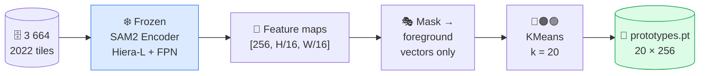
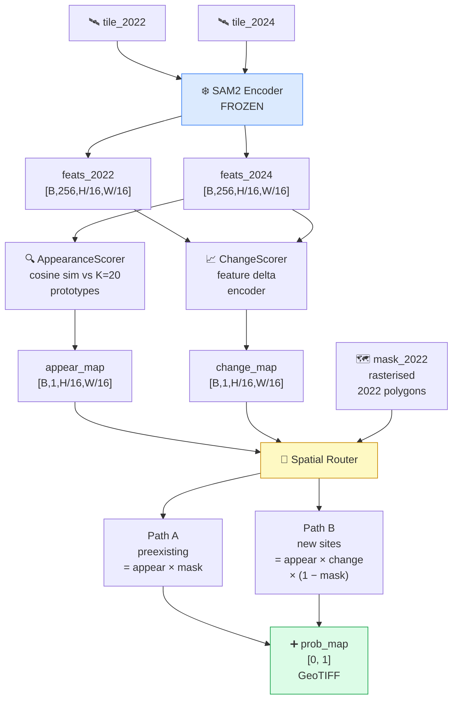
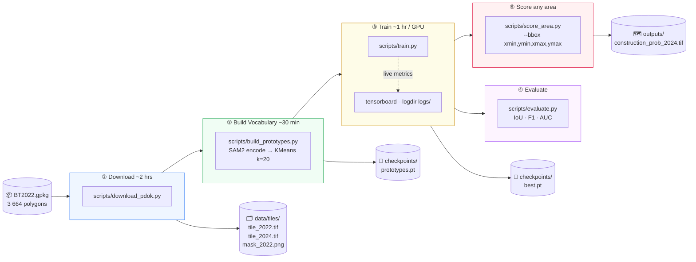

<div align="center">

# 🕵️ SamSpade

### *SAM2 meets a shovel. Construction sites don't stand a chance.*

**One-shot aerial construction site detection · Netherlands · No 2024 labels needed**

[](https://python.org)
[](https://pytorch.org)
[](https://github.com/facebookresearch/sam2)
[](https://service.pdok.nl)
[](LICENSE)

</div>

---

## What is this?

The Dutch government keeps a database of ~3 700 active construction sites from its 2022 land-use survey. **SamSpade** answers two questions from the sky, without any 2024 labels:

| Question | What we look for |
|---|---|
| 🔄 **Still under construction?** | Was a site in 2022, *still looks like construction* in 2024 |
| 🆕 **New site appeared?** | Wasn't construction in 2022, *now looks like construction* in 2024 |

Imagery comes from [PDOK](https://service.pdok.nl/hwh/luchtfotorgb/wms/v1_0) — the Netherlands' free 8 cm orthophoto service.

---

## The Problem With Construction Sites

> A car looks like a car. A swimming pool looks like a swimming pool.
> A construction site looks like **whatever stage of a 3-year process happened to be visible that day.**

Bare soil. Tower cranes. Concrete formwork. Scaffolding. Rebar grids. Excavations.
All the same class. None of them look alike.

A single prototype vector (the usual one-shot approach) averages all of that into noise.

**SamSpade's answer:** don't use one prototype. Build a **vocabulary** of 20.

---

## How It Works

### Step 1 — Build a Visual Vocabulary of Construction



The 20 cluster centroids capture the **full visual vocabulary** of Dutch construction sites — one cluster might be bare earth, another scaffolding, another rebar. All without a single 2024 label.

---

### Step 2 — Score New Imagery Against the Vocabulary



---

### Step 3 — The Routing Logic (the clever bit)

The 2022 land-use mask acts as a **hard spatial router**. Each pixel goes through exactly one path:

```
╔══════════════════════════════════════════════════════════════════╗
║  Was this pixel construction in 2022?                            ║
╠══════════════════════════════════════╦═══════════════════════════╣
║  YES  →  PATH A (Preexisting)        ║  NO  →  PATH B (New)      ║
║                                      ║                           ║
║  score = appearance_2024             ║  score = appearance_2024  ║
║                                      ║        × change_score     ║
║  ✅ still looks like construction?   ║                           ║
║     → flag it                        ║  ✅ looks like constr.    ║
║  ✅ now looks like a building?       ║     AND changed?          ║
║     → suppress (completed!)          ║     → flag it             ║
║                                      ║  ✅ stable field/road?    ║
║  ⚠️  change signal NOT used here    ║     → suppress            ║
║     (it would be LOW for ongoing     ║                           ║
║      sites = false negatives)        ║                           ║
╚══════════════════════════════════════╩═══════════════════════════╝

combined = PATH A + PATH B    ← spatially disjoint, no pixel counted twice
```

---

## Pipeline



---

## Quick Start

### Environment

```bash
conda create -n samspade python=3.11
conda activate samspade
pip install -r requirements.txt
```

### 1 — Download tiles

```bash
python scripts/download_pdok.py \
    --polygons data/raw/BT2022.gpkg \
    --years 2022 2024 \
    --resolution 8cm \
    --out data/tiles/
```

> ⏱ ~2 hours · resumable · skips already-downloaded tiles

### 2 — Build the vocabulary

```bash
python scripts/build_prototypes.py \
    --tiles  data/tiles/ \
    --k      20 \
    --out    checkpoints/prototypes.pt
```

### 3 — Train

```bash
python scripts/train.py --config configs/train.yaml

# Watch it live
tensorboard --logdir logs/
```

### 4 — Score any area of the Netherlands

```bash
python scripts/score_area.py \
    --bbox        100000,450000,150000,500000 \
    --prototypes  checkpoints/prototypes.pt \
    --checkpoint  checkpoints/best.pt \
    --mask2022    data/raw/BT2022.gpkg \
    --out         outputs/construction_prob_2024.tif
```

Output is a float32 GeoTIFF in **EPSG:28992** with pixel values in `[0, 1]`.
Load it in QGIS, ArcGIS, or any raster tool.

---

## Data & Sources

| | Source | Detail |
|---|---|---|
| 🛰️ **Imagery** | [PDOK Luchtfoto WMS](https://service.pdok.nl/hwh/luchtfotorgb/wms/v1_0) | 8 cm orthoHR, layers `2022_orthoHR` / `2024_orthoHR` |
| 🗺️ **Polygons** | BT2022.gpkg | 3 664 construction sites, Dutch land-use survey, EPSG:28992 |

<details>
<summary>🔧 PDOK WMS gotchas (learned the hard way)</summary>

| Gotcha | What happens | Fix |
|---|---|---|
| `TIME` parameter | Silently ignored — returns current year | Use year-specific layer names: `2022_orthoHR` |
| Small bbox | Returns pure white image | Enforce **600 m minimum** extent centred on polygon |
| `2021_ortho25` | Layer does not exist on the service | Skip 2021; use 2020 or 2022 instead |
| `owslib.getmap` | Inconsistent behaviour on this endpoint | Use `requests.Session` directly |

</details>

---

## Model at a Glance

| Component | Role | Trainable |
|---|---|---|
| SAM2 Hiera-L + FPN | Image encoder — extracts rich 256-dim features | ❌ Frozen |
| `AppearanceScorer` | Cosine similarity of 2024 features vs K=20 prototypes | ✅ |
| `ChangeScorer` | Encodes the feature delta between 2022 and 2024 | ✅ |
| Spatial Router | Routes each pixel through the correct detection path | — (no params) |

**~2 M trainable** parameters on top of a **~300 M frozen** SAM2 backbone.

---

## Project Structure

```
SamSpade/
├── 📁 configs/
│   ├── base.yaml            # Shared hyperparameters
│   ├── train.yaml           # Training overrides
│   └── inference.yaml       # Inference overrides
├── 📁 data/
│   ├── pdok_downloader.py   # PDOK WMS client
│   ├── dataset.py           # ConstructionChangeDataset
│   └── transforms.py        # Augmentation pipeline
├── 📁 models/
│   ├── detector.py          # ConstructionChangeDetector (top-level)
│   ├── appearance_scorer.py # Cosine sim vs corpus prototypes
│   ├── change_scorer.py     # Feature delta encoder
│   ├── corpus_prototype.py  # KMeans prototype builder
│   └── feature_utils.py     # Shared helpers
├── 📁 losses/
│   └── segmentation_losses.py   # BCE + Dice
├── 📁 training/
│   └── trainer.py           # Training loop · AMP · checkpointing
├── 📁 evaluation/
│   └── metrics.py           # IoU · F1 · AUC
└── 📁 scripts/
    ├── download_pdok.py     # ① tile downloader
    ├── build_prototypes.py  # ② vocabulary builder
    ├── train.py             # ③ model training
    ├── evaluate.py          # ④ metrics
    └── score_area.py        # ⑤ GeoTIFF output
```

---

## Requirements

- Python 3.11+
- PyTorch ≥ 2.3 with CUDA (SAM2 Hiera-L is large)
- ~50 GB disk for all tile pairs at 8 cm orthoHR

---

<div align="center">

*Named after Sam Spade — the detective who always finds what's hidden.*
*Powered by SAM2 — the model that segments anything.*
*Built for the Netherlands — where everything is always under construction.*

</div>
